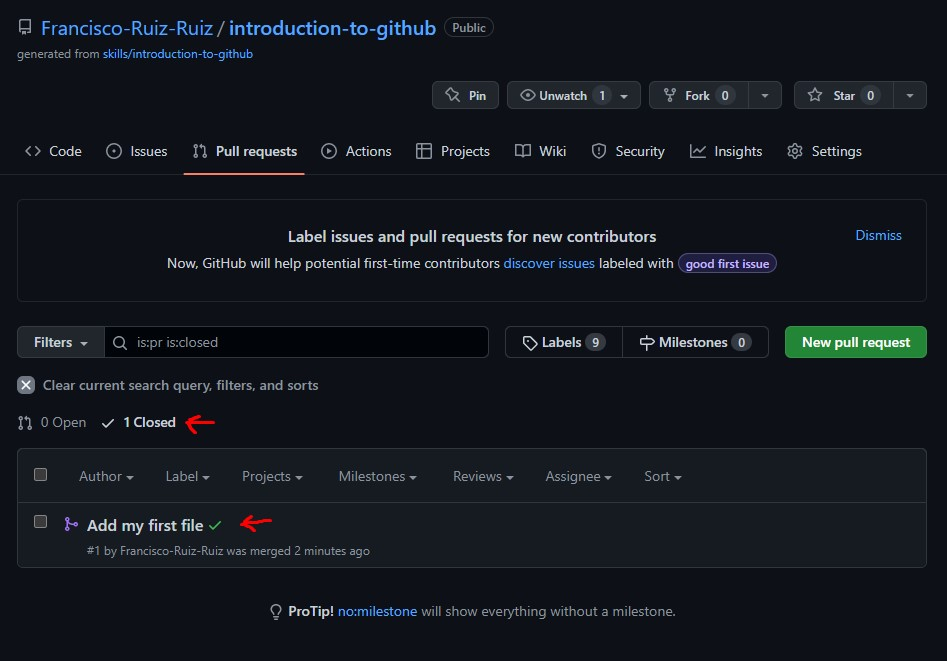

# Preguntas propuestas
1. Busca en Wikipedia e indica:
   1. Qué es GitHub y su relación con Git
      * Github es un portal creado para alojar el código de las aplicaciones de cualquier desarrollador
   2. Compañía dueña de GitHub
        * Microsoft
2. Qué es una rama en el código (branch of the code)
   * Una salida en la que un miembro del trabajo hace modificaciones para no afectar directamente a la rama principal
3. Qué es una nueva característica en el código (new feature)
   * Una señal que indica que hay codigo nuevo o modificado con respecto a commits anteriores
4. Qué es un pull request 
   * Una forma de compartir trabajo de un branch con otros miembros de un trabajo
5. Qué es un merge
   * Sirve para aplicar los cambios del branch a la rama principal
6. Qué es un issue
   * Es un reporte sobre un error encontrado en un código
7. Qué es una mención y qué implica
   * Sirve para señalar quien es el autor
8. Qué es una etiqueta (label) y por qué su uso
   * Su función es clasificar las propuestas y solicitudes de modificaciones en el código ya sea en un branch o en la rama principal
9.  Qué son las notificaciones. Indica las tres opciones de notificaciones
    * GitHub tiene la opción de notificar cambios en el código, para ello ofrece 3 tipos de notificación:
      - Notificar toda la actividad
      - Notificar menciones
      - Ignorar todo
    * De forma adicional puedes personalizar las notificaciones
10.  Qué son GitHub Pages
    * Es un método de hosteo en web que utiliza GitHub
11.  Qué es GitHub Flow
    * Es la forma de trabajo distribuida en ramas que se utiliza en GitHub

